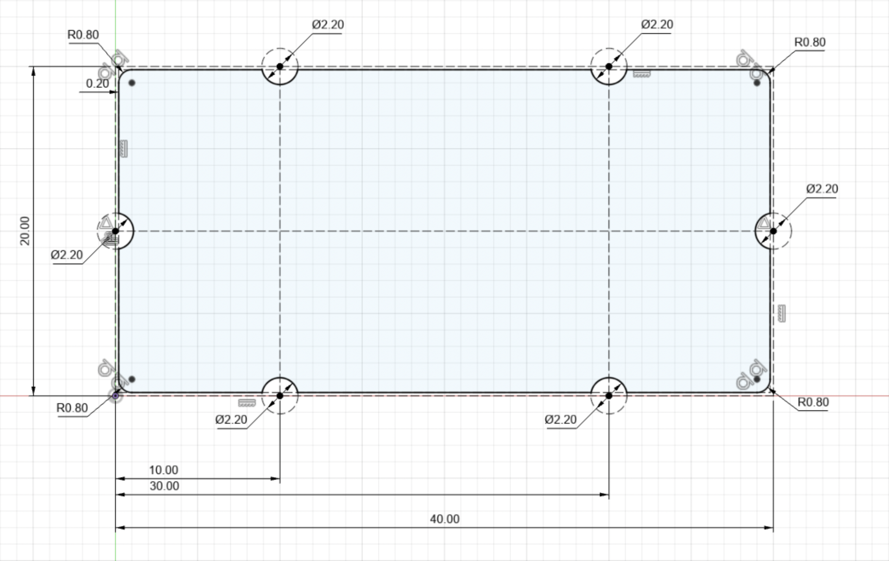

# 介绍

## 动机

硬件产品的开发起始阶段，我们通常需要利用现有的开发板搭建一套最小可用原型。我们可能需要在开发板上连接各种串口转接板、调试器以及一些外设。这就不可避免地产生非常多的飞线。传统的面包板虽然能解决一部分问题，但是电路只能向一个方向延伸，且没有很好地固定元器件。而即便现在 PCB 打样已足够便宜，但绘制和打样 PCB 都需要数天时间。

对此，TILE 的解决思路是，将常用的功能模块封装为标准尺寸的、可复用的 PCB。它们可以随意组合、固定在一块基板上。此外，我们还设计了一些理线器用于固定模块之间的飞线。使整套原型成为一个简洁、便携的整体。

## 规范

TILE 以 20mm × 20mm 为基本单位设计模块。这使得模块尺寸统一，可以整齐地被固定在基板上。为此，我们对模块的外形制定了一些规范，以便基于这些规范来设计模块。

详情请见：[规范](/spec/)。

## 通用模块

* _(打样中)_ [#0102 - USB-SWITCH](#) - 一个 USB 转接器，附带自锁开关和 LED 指示灯，便于快速上下电而不需要重新插拔设备
* _(打样中)_ [#0102 - TILEDAP](#) - 一个 DAPLink 调试器，附带 USB-UART 桥接功能
* _(设想中)_ [#0101 - PUSH](#) - 一个简易的 8.5mm 开关，附带 LED 指示灯
* _(设想中)_ [#0101 - SERIAL-CH343](#) - 基于 CH343 的 USB-UART 转接器
* _(设想中)_ [#0101 - SERIAL-CP2102N](#) - 基于 CP2102N 的 USB-UART 转接器，并且附带 ESP32 兼容的自动烧录电路
