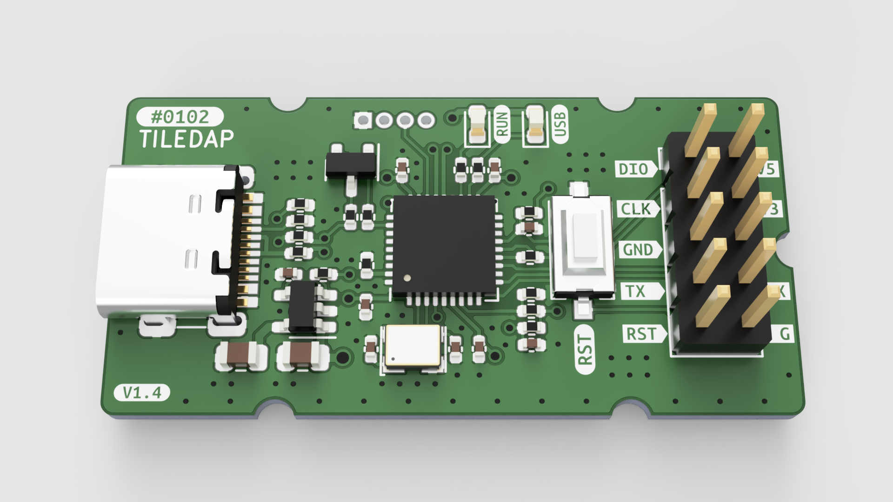

# 模块

TileParts 设计了一些通用模块。如无特别指出，它们皆以 [CERN-OHL-P-2.0](https://spdx.org/licenses/CERN-OHL-P-2.0.html) 协议开源。你可以自行进入对应项目仓库的 Releases 页面下载 Gerber/BOM/坐标文件打样。此外，你也可以根据[规范](/spec/)自行设计兼容的模块。

## 模块列表

* [#0101 - CLIP](https://github.com/TileParts/0101-CLIP) - 一个普通的夹子，用于固定飞线
* [#0101 - HOTSWAP-KEY](https://github.com/TileParts/0101-HOTSWAP-KEY) _(打样中)_ - 一个机械键盘热插拔轴座的转接板
* [#0101 - PUSH](https://github.com/TileParts/0101-PUSH) - 一个简易的 8.5mm 开关，附带 LED 指示灯
* #0101 - SERIAL-CH343 _(设想中)_ - 基于 CH343 的 USB-UART 转接器
* #0101 - SERIAL-CP2102N _(设想中)_ - 基于 CP2102N 的 USB-UART 转接器，并且附带 ESP32 兼容的自动烧录电路
* [#0102 - TILEDAP](https://github.com/TileParts/0102-TILEDAP) _(打样中)_ - 一个 DAPLink 调试器，附带 USB-UART 桥接功能
* [#0102 - USB-SWITCH](https://github.com/TileParts/0102-USB-SWITCH) _(打样中)_ - 一个 USB 转接器，附带自锁开关和 LED 指示灯，便于快速上下电而不需要重新插拔设备
